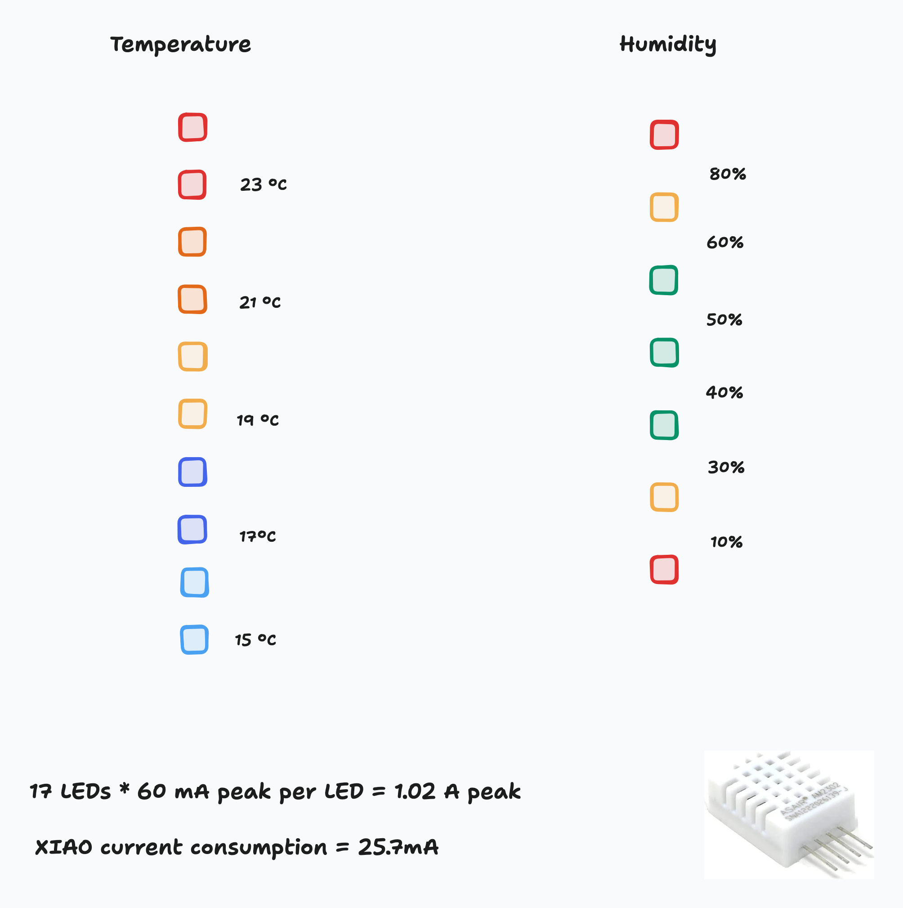
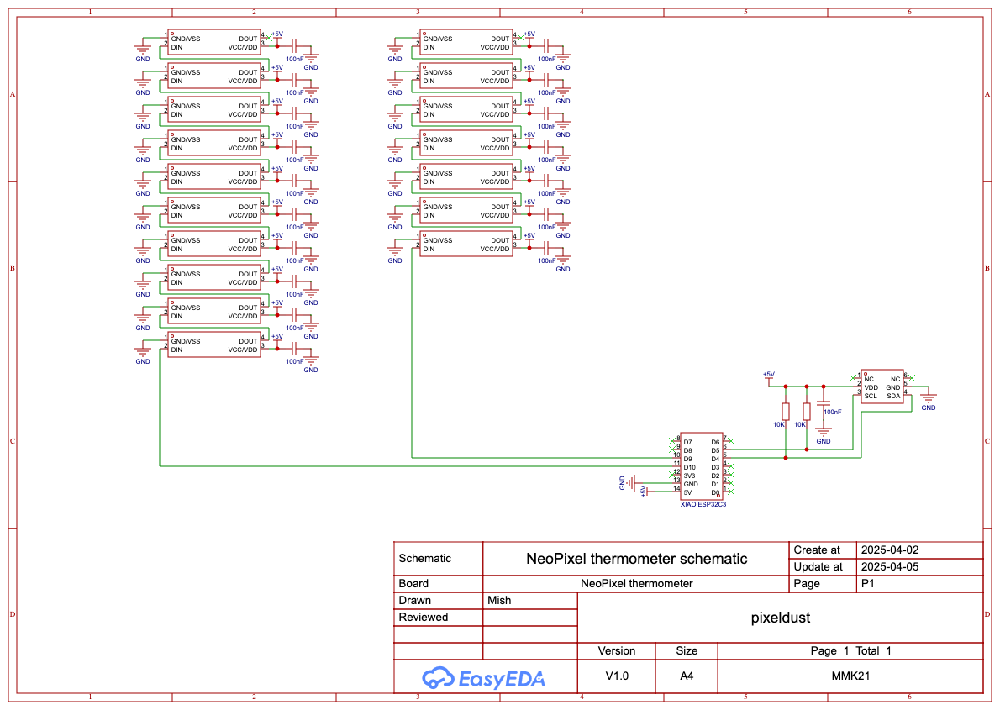
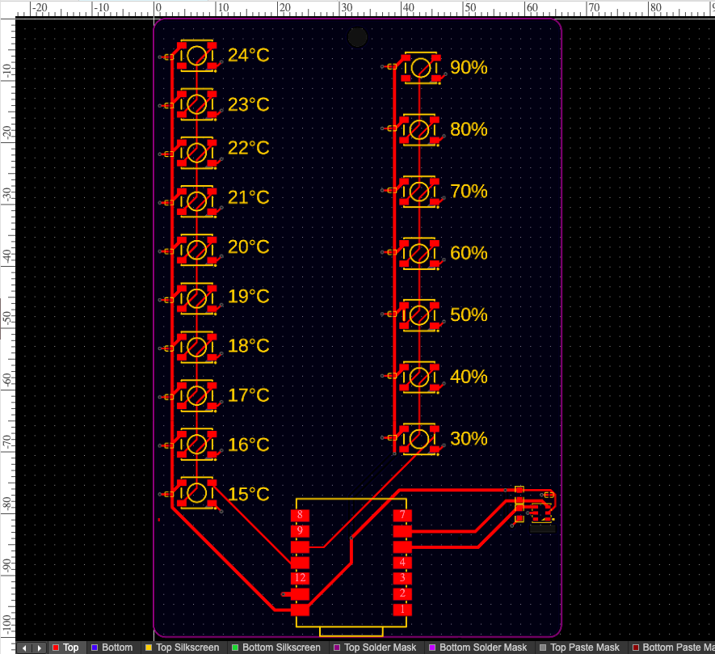
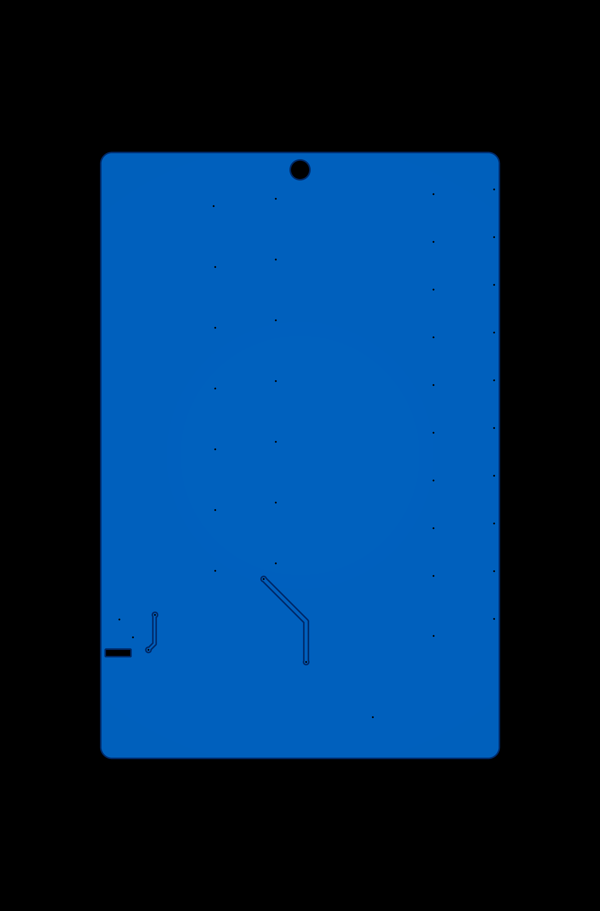
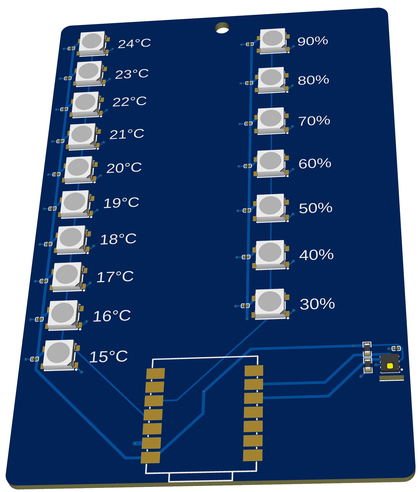

# NeoPixel Themometer

## Wokwi link

TODO Replace the wokwi link below with mine

Wokwi link: [https://wokwi.com/projects/XXXXXX](https://wokwi.com/projects/XXXXXX)

## About

Digital thermometers with numerical displays are boring! So, I made a temperature (and humidity!) sensing device powered by RGB NeoPixel LEDs. It uses an AHT20 temperature & humidity sensor to sense how hot, cold, or humid it is, then displays the temperature using a 10-LED colored gradient, and the humitity using a 7-LED scale.

It's designed to work with temperatures from 15°C to 25°C (i.e. normal room temperature ranges for the UK), and relative humidity values from 30% to 100%. This could be changed by tweaking the silkscren text and the software, though.

## Bill of materials

<!-- TODO: A simplified BOM table
(include rough pricing of any extra components you're using)

Example:

| Comment           | Footprint                                      | Quantity | LCSC     | Cost   |
|-------------------|------------------------------------------------|----------|----------|--------|
| 100uF             | C_1206_3216Metric_Pad1.33x1.80mm_HandSolder    | 1        | C15008   | 0.0682$|
| 4.7nF             | C_0402_1005Metric_Pad0.74x0.62mm_HandSolder    | 3        | C1538    | 0.0011$|
| WS2812B           | LED_WS2812B_PLCC4_5.0x5.0mm_P3.2mm             | 9        |          |
| XIAO-RP2040-DIP   | XIAO-RP2040-DIP                                | 1        |          |
| Cherry MX         | SW_Cherry_MX_1.00u_PCB                         | 2        |          | 6.48$ for 8, 1.62$ for 2 |
 -->

## Design process

<!-- Tell us a little bit about your design process. What were some challenges? What helped? -->

Once I had the idea for the project, I made a simple [mockup of the LED layout](https://www.tldraw.com/f/wIqEhbxRnkui7VBJU_q1x?d=v330.1.2188.1465.YdsrRqgbpH172HVnukqYR) in tldraw.

This was my first time designing a PCB, and I chose to use [EasyEDA Pro](https://pro.easyeda.com/) to design the schematic and PCB. I read through some of the PCB Hack Club Jams to learn how to do PCB things - I foudn the [SparkleTilt jam](https://jams.hackclub.com/batch/sparkletilt-pcb/part-1) to be incredibly helpful.

I went through 3 stages of ovecomplicating and then simplifying:

If I could, I'd have given some advice to my past self:

- Properly think about where you'd want the componenets on the real thing when you're making the schematic, because it makes creating the PCB way easier
  - I did this to an extent, but I failed to consider that I'd want the Xiao's USB port at the bottom of the board, and making that change meant that I had to flip quite a few components around.
- Read _all_ of the Pixeldust guide, to learn that I don't need a decoupling capacitor for _every single NeoPixel_
  - My design included a capacitor for every NeoPixel, and I now realise that that's not required. (But it's too late to update the design now!)
  - Alternatively, talk to my friend who knows about PCBs earlier, because he spotted the issue too.

## Images

<!-- Some images of your design (make sure to include both the PCB and Schematic!): -->

### Mockup

### Electronic schematic

### PCB design

### 2D render

### 3D render

