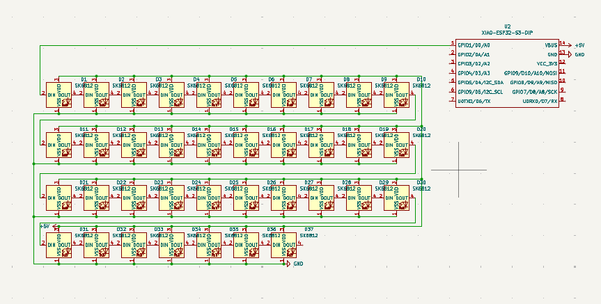
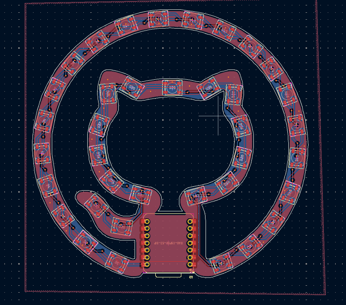
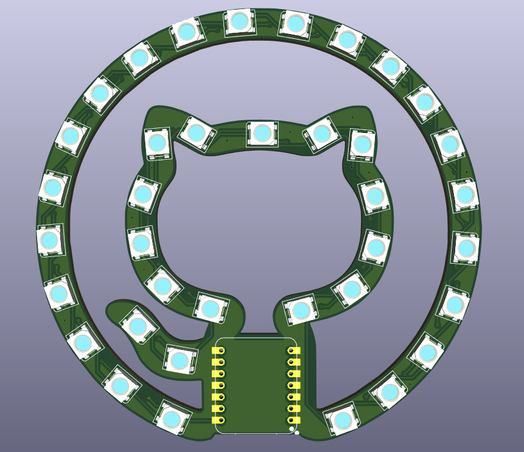

# OctoGlow

Replace the wokwi link below with yours

Wokwi link: [https://wokwi.com/projects/428162293968281601](https://wokwi.com/projects/428162293968281601)

<!-- Uncomment the line below if you need a soldering iron -->
<!-- ⚠️ I would like to [reason for iron], so I would need a soldering iron. -->

Describe your board in 2-3 sentences.
My board is the Github Invertocat Logo, which they also sell on their shop: [https://thegithubshop.com/products/1541981-00-invertocat-neon-light](https://thegithubshop.com/products/1541981-00-invertocat-neon-light). Since it uses a ESP32, it can recieve audio from my computer and react to the audio, making it a sound-reactive light. If not connected, it can just act as a standby logo with rgb lighting. I also plan to design a stand for it in fusion.

A simplified BOM table

| Comment           | Footprint                                      | Quantity | LCSC     | Cost   |
|-------------------|------------------------------------------------|----------|----------|--------|
| SK6812            | LED_SK6812_PLCC4_5.0x5.0mm_P3.2mm              | 37       | [Link](https://www.lcsc.com/search?q=sk6812&s_z=n_sk6812)        |  $0.0853  |
| XIAO-ESP32-DIP    | XIAO-ESP32S3-DIP                               | 1        | Not on LCSC: [Seeed Website](https://www.seeedstudio.com/XIAO-ESP32S3-p-5627.html?srsltid=AfmBOopQc7PIUGoDDChqHyr4Ey21go1FLUvC9Jo5roqpxXUTFXgFiPX4)         | $7.50 |

Tell us a little bit about your design process. What were some challenges? What helped?
This is my third time designing a PCB, so I had some experience but also had to learn how to do a few things. One of the hardest parts was getting the custom shape for my PCB, as I had to figure out how to import the github logo PNG into KiCad as a edge.cuts. Then I had to figure out how to fix the edge.cuts layer since it had many errors. I was able to solve these problems by watching various videos on how to import custom PCB shapes in KiCad.

Some images of your design (make sure to include both the PCB and Schematic!):

### Schematic

### PCB

### 3D Render

