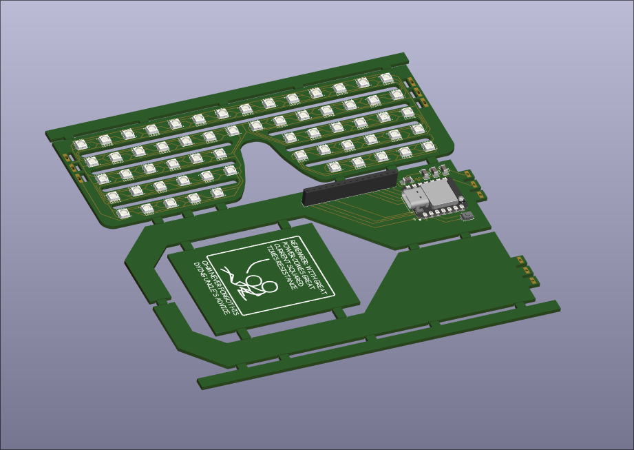
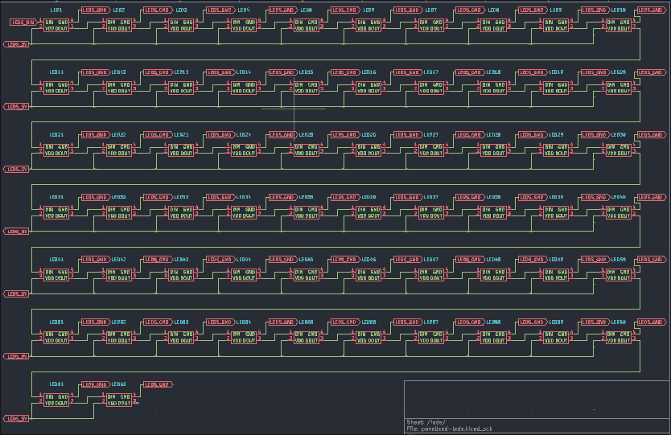

# LED Glasses

Wokwi link: [https://wokwi.com/projects/428024875914576897](https://wokwi.com/projects/428024875914576897)

<!-- Describe your board in 2-3 sentences. What are you making? What will it do? Please add a lot of pictures here!! -->

LED glasses, which you can put on, configure and see through! They look kind of cool, shouldn't be that uncomfortable to wear.
There is a button on the side, which can be used to toggle between different animations. In the future I plan on implementing a website that can be used to change the animation and modify each pixel individually. The website could be used by the user by connecting to the XIAO ESP32-S3 (in WAP mode).

This board is a panelized PCB that has 3 parts.

A simplified BOM table:

> !WARNING!
> The prices in the table are the total amount (not per unit)!

| Comment           | Footprint                                      | Quantity | LCSC     | Cost   |
|-------------------|------------------------------------------------|----------|----------|--------|
| 100uF             | Capacitor_C1206_SMD                            | 1        | C15008   | 0.0682$|
| 4.7nF             | Capacitor_C1206_SMD                            | 3        | C9192    | 0.0315$|
| SK6812MINI-012    | LED-SMD_4P-L3.7-W3.5-P1.75-BR-SK6812MINI       | 62       | C2886570 | 5.7350$|
| XIAO ESP32-S3     | XIAO ESP32-S3                                  | 1        |          |        |  
| Tactile switch    | SW-SMD_L3.9-W3.0-P4.45                         | 1        | C720477  | 0.0394$|

The design process wasn't that bad, the challenge I faced the most were repetitive tasks I couldn't automate, the wiring of the PCB was also somewhat tricky because of the tight space and the amount of connections. But the hardest thing was getting the EasyEDA 3D models for the PCB.

## License

My code and design are licensed under the GPLv3 license available at: https://www.gnu.org/licenses/gpl-3.0.en.html
